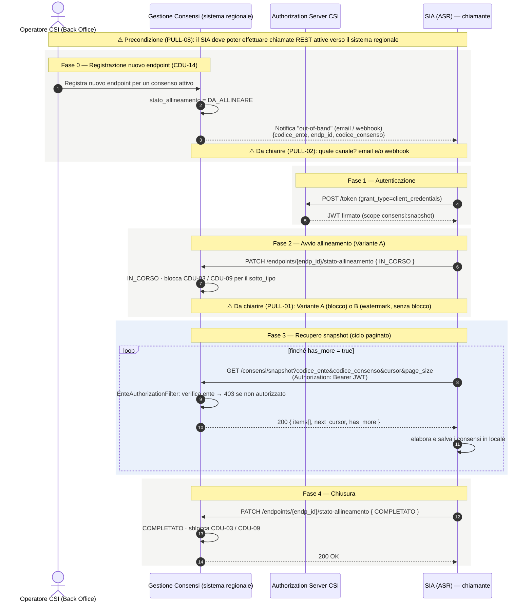

---
{"dg-publish":true,"permalink":"/cdu-17-diagramma-sequenza/","dg-note-properties":{}}
---

# CDU-17 — Diagramma di sequenza (allineamento consensi in modalità PULL)

**Scopo:** anticipare al committente il funzionamento del **CDU-17**, il caso d'uso che sostituisce **BATCH-03**. Quando si registra un nuovo endpoint per una ASR, non è più il sistema regionale a "spingere" (push) i consensi: è il **SIA della ASR** che li **scarica** (pull) da un servizio REST paginato ("centro stella"). Il diagramma evidenzia in giallo i **punti d'interazione da disambiguare** con CSI.

> Nota: CDU-17 è una **proposta tecnica** (rif. TR34/TR68, ADR-006) in attesa di sign-off formale CSI.

---

## Diagramma

---

## I passi, in parole semplici

0. **Registrazione (Back Office).** Un operatore CSI aggiunge un nuovo endpoint per una ASR (CDU-14). Il sistema segna quell'endpoint come **DA_ALLINEARE** e avvisa il SIA che c'è da fare l'allineamento (notifica "fuori banda").
1. **Autenticazione.** Il SIA chiede un token all'Authorization Server di CSI e ottiene un **JWT** con il permesso `consensi:snapshot`.
2. **Avvio.** Il SIA dichiara "sto iniziando" (**IN_CORSO**). Nella *Variante A* il sistema, per avere una "foto" coerente, **blocca temporaneamente** i nuovi consensi di quel tipo.
3. **Scaricamento a pagine.** Il SIA chiama ripetutamente `GET /consensi/snapshot` passando un **cursore**; a ogni chiamata riceve una pagina di consensi + il cursore per la successiva, finché **`has_more = false`**. A ogni chiamata il sistema verifica che il SIA stia leggendo **solo i dati del proprio ente**.
4. **Chiusura.** Il SIA dichiara **COMPLETATO**; il sistema sblocca le acquisizioni e l'allineamento è concluso.

---

## Punti d'interazione da disambiguare (per la riunione)

| #   | Punto                       | Domanda a CSI                                                                                                                  | Rif.    |
| --- | --------------------------- | ------------------------------------------------------------------------------------------------------------------------------ | ------- |
| A   | **Capacità del SIA**        | Il SIA può fare chiamate REST *attive* verso il regionale (firewall, scheduling)?                                              | PULL-08 |
| B   | **Canale di notifica**      | Come avvisiamo il SIA del nuovo endpoint: solo email o anche webhook configurabile?                                            | PULL-02 |
| C   | **Coerenza dello snapshot** | **Variante A** (blocco delle acquisizioni durante il pull) o **Variante B** (nessun blocco + watermark `X-Watermark-Cons-Id`)? | PULL-01 |
| D   | **Conferma completamento**  | Il PATCH di conferma è idempotente, oppure si rileva la fine con timeout?                                                      | PULL-07 |
| E   | **Dimensione pagina**       | Valore massimo di `page_size` e se tarabile per ASR                                                                            | PULL-04 |

**Variante B (senza blocco), in breve:** si salta il PATCH `IN_CORSO`; durante il pull le acquisizioni restano attive; lo snapshot restituisce l'header `X-Watermark-Cons-Id` e, a fine ciclo, il SIA recupera via **CDU-15** i consensi arrivati dopo il watermark. Zero downtime, ma un po' più di logica lato SIA.

---

*Riferimenti wiki: [[wiki/concepts/alternativa-batch-03-pull\|Alternativa BATCH-03 — PULL CDU-17]] · [[wiki/concepts/sicurezza-cdu-15-16\|Sicurezza CDU-15/16]] · SRS §6.17. Dettaglio punti aperti: [[wiki/analyses/analysis-2026-05-14-punti-aperti-csi\|Tracker punti aperti CSI]] §3.*
