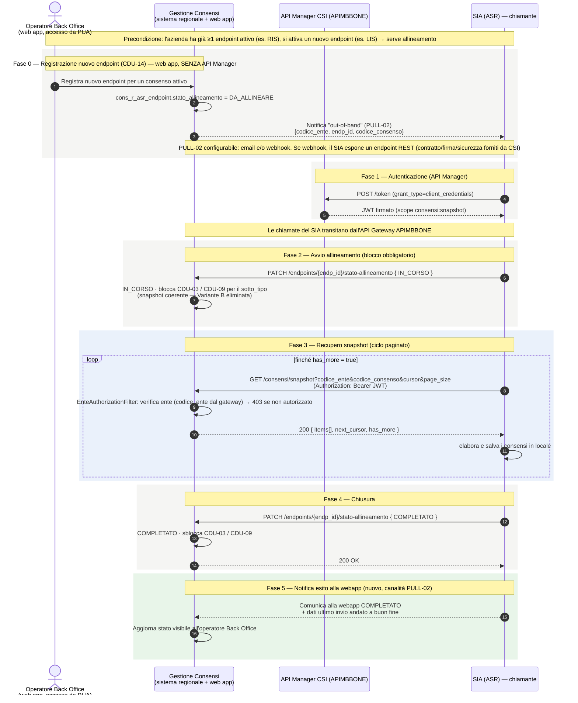

---
{"dg-publish":true,"permalink":"/cdu-17-diagramma-sequenza/","dg-note-properties":{}}
---

# CDU-17 — Diagramma di sequenza (allineamento consensi in modalità PULL)

**Scopo:** descrivere il funzionamento del **CDU-17**, il caso d'uso che sostituisce **BATCH-03**. Quando un operatore di **Back Office** registra un nuovo endpoint per un'azienda che ha **già almeno un altro endpoint attivo** (es. RIS attivo, si attiva un LIS → serve allineamento dei consensi), non è più il sistema regionale a "spingere" (push) i consensi: è il **SIA della ASR** che li **scarica** (pull) da un servizio REST paginato ("centro stella").

> **Aggiornamento call CSI 20/07/2026 (rifacimento CDU-17):**
> - Attore = **operatore con profilo Back Office** sulla **web app Gestione Consensi** (accesso da **PUA**).
> - **Variante B (watermark/no-blocco) ELIMINATA**: il blocco temporaneo delle acquisizioni è **obbligatorio** (unica modalità) per garantire uno snapshot coerente.
> - Token rilasciato dall'**API Manager CSI (APIMBBONE)**; le chiamate REST del SIA transitano dall'**API Gateway** dell'APIM (che inoltra al backend CF + `codice_ente`). Le **operazioni della web app NON passano dall'API Manager** (integrazione diretta — doppia esposizione).
> - **Nuovo passo 5**: a chiusura, il SIA **comunica alla webapp lo stato COMPLETATO e i dati dell'ultimo invio andato a buon fine**, tramite la **stessa canalità di PULL-02**.
> - **Canale notifica PULL-02 (deciso 20/07/2026):** si mantengono **entrambe** le modalità — **email e/o webhook** — selezionabili via **parametro di configurazione** (solo email / solo webhook / entrambi). Con il **webhook** il SIA deve **esporre un servizio REST**, il cui **contratto, firma e sicurezza sono forniti da CSI**.
> - I servizi di **inserimento/modifica/elimina endpoint** della web app sono **esposti anche alle aziende** via API Manager (cfr. §"Servizi endpoint esposti alle aziende").
> - Scenario di **manutenzione endpoint** (senza inserimento di nuovo endpoint) trattato a parte: [[Manutenzione-endpoint_diagramma-sequenza\|Manutenzione endpoint — Diagramma di sequenza]].

> Nota: CDU-17 è una **proposta tecnica** (rif. TR34/TR68, ADR-006); il rifacimento 20/07/2026 recepisce le indicazioni del committente.

---

## Diagramma

---

## I passi, in parole semplici

0. **Registrazione (Back Office).** Un operatore con **profilo Back Office**, sulla web app Gestione Consensi (accesso da **PUA**), aggiunge un nuovo endpoint per una ASR (CDU-14). Il sistema segna quell'endpoint come **DA_ALLINEARE** e avvisa il SIA che c'è da fare l'allineamento (notifica "fuori banda"). La notifica può essere via **email e/o webhook** (configurabile con apposito parametro); con il **webhook** il SIA espone un endpoint REST il cui **contratto è fornito da CSI**. *Questa operazione della web app NON passa dall'API Manager.*
1. **Autenticazione.** Il SIA chiede un token all'**API Manager di CSI (APIMBBONE)** e ottiene un **JWT** con il permesso `consensi:snapshot`.
2. **Avvio.** Il SIA dichiara "sto iniziando" (**IN_CORSO**). Per avere una "foto" coerente, il sistema **blocca temporaneamente** i nuovi consensi di quel tipo. *(Unica modalità — la variante watermark senza blocco è stata eliminata.)*
3. **Scaricamento a pagine.** Il SIA chiama ripetutamente `GET /consensi/snapshot` passando un **cursore**; a ogni chiamata riceve una pagina di consensi + il cursore per la successiva, finché **`has_more = false`**. A ogni chiamata il sistema verifica che il SIA stia leggendo **solo i dati del proprio ente**.
4. **Chiusura.** Il SIA dichiara **COMPLETATO**; il sistema sblocca le acquisizioni e l'allineamento è concluso.
5. **Notifica esito alla webapp.** Il SIA **comunica alla webapp lo stato COMPLETATO e i dati dell'ultimo invio andato a buon fine**, tramite la **stessa canalità di PULL-02**. La webapp aggiorna lo stato visibile all'operatore.

---

## Servizi endpoint esposti alle aziende (via API Manager)

I servizi di **inserimento / modifica / eliminazione endpoint** previsti dalla web app Gestione Consensi devono essere **esposti anche alle aziende**, che li richiamano **passando dall'API Manager (APIMBBONE)**. In questo modo i Sistemi Informativi Aziendali possono:

- **allineare i consensi** (CDU-17, questo diagramma);
- **bloccare l'acquisizione dei consensi durante i periodi di manutenzione** → vedi scenario dedicato [[Manutenzione-endpoint_diagramma-sequenza\|Manutenzione endpoint]].

> ⚠️ **Doppia esposizione (ribadita 20/07/2026):** tutte le operazioni effettuate **dalla web app** Gestione Consensi **NON** prevedono l'API Manager (integrazione diretta). Solo le chiamate di **SIA/aziende** passano dall'API Gateway APIMBBONE.

---

## Punti d'interazione — stato dopo la call 20/07/2026

| #   | Punto                       | Esito                                                                                                     | Rif.    |
| --- | --------------------------- | --------------------------------------------------------------------------------------------------------- | ------- |
| A   | **Capacità del SIA**        | ✅ Il SIA **può** fare chiamate REST attive verso il regionale (via API Manager) — confermato             | PULL-08 |
| B   | **Canale di notifica**      | ✅ **Deciso:** email **e/o** webhook, via parametro di configurazione (solo email / solo webhook / entrambi). Con webhook il SIA espone un endpoint REST (contratto/firma/sicurezza forniti da CSI) | PULL-02 |
| C   | **Coerenza dello snapshot** | ✅ **Blocco obbligatorio** durante il pull (Variante A). **Variante B watermark ELIMINATA**               | PULL-01 |
| D   | **Conferma completamento**  | PATCH di conferma idempotente                                                                              | PULL-07 |
| E   | **Dimensione pagina**       | `page_size` max e tarabilità per ASR da precisare                                                          | PULL-04 |

---

*Riferimenti wiki: [[wiki/concepts/alternativa-batch-03-pull\|Alternativa BATCH-03 — PULL CDU-17]] · [[Manutenzione-endpoint_diagramma-sequenza\|Manutenzione endpoint]] · [[wiki/concepts/sicurezza-cdu-15-16\|Sicurezza CDU-15/16]] · SRS §6.17. Dettaglio punti aperti: [[wiki/analyses/analysis-2026-05-14-punti-aperti-csi\|Tracker punti aperti CSI]] §3.*
