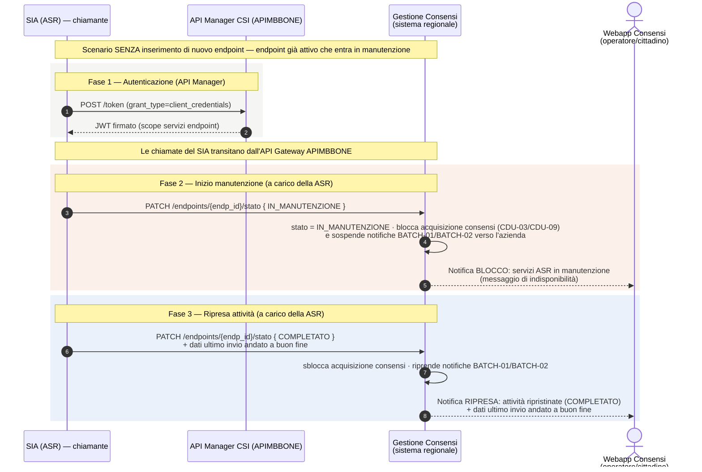

---
{"dg-publish":true,"permalink":"/manutenzione-endpoint-diagramma-sequenza/","dg-note-properties":{}}
---

# Manutenzione endpoint — Diagramma di sequenza (blocco acquisizione durante manutenzione)

**Scopo:** descrivere lo scenario — **distinto da CDU-17** — in cui **non** si inserisce un nuovo endpoint, ma un'azienda (ASR) entra in **finestra di manutenzione** di un endpoint già attivo. Durante la manutenzione il sistema deve **bloccare l'acquisizione dei consensi** verso quell'azienda e **notificare la webapp** Gestione Consensi sia dell'inizio del blocco sia della ripresa delle attività.

> **Origine:** call CSI 20/07/2026 (rifacimento CDU-17) — "MANCA SCENARIO DI MANUTENZIONE END-POINT". Si lega alla decisione dell'11/06/2026 recepita in **SRS v6 §7.4 (Gestione manutenzione ASR — start/stop servizi)**.

> **Ipotesi (da confermare in progettazione):** introduzione dello stato **IN_MANUTENZIONE** sull'endpoint. La segnalazione di **inizio e fine** manutenzione è a carico della **ASR**. I relativi servizi start/stop sono **esposti alle aziende via API Manager (APIMBBONE)**; le operazioni della web app restano dirette (senza API Manager).

---

## Diagramma

---

## I passi, in parole semplici

1. **Autenticazione.** Il SIA chiede un token all'**API Manager (APIMBBONE)** con lo scope adeguato ai servizi di gestione endpoint.
2. **Inizio manutenzione.** Il SIA (a carico della ASR) dichiara l'endpoint **IN_MANUTENZIONE**. Il sistema:
   - **blocca l'acquisizione dei consensi** (CDU-03/CDU-09) per l'azienda interessata;
   - **sospende le notifiche** BATCH-01/BATCH-02 verso quei sistemi;
   - **notifica la webapp** Consensi del blocco (messaggio di indisponibilità per i servizi dell'ASR).
3. **Ripresa.** Il SIA dichiara la fine manutenzione (**COMPLETATO**) comunicando i **dati dell'ultimo invio andato a buon fine**. Il sistema sblocca l'acquisizione, riprende le notifiche e **notifica la webapp** della ripresa.

---

## Note e punti da confermare

- **Stato IN_MANUTENZIONE** — è un'ipotesi introdotta dalla call 20/07/2026: modello dati e macchina a stati dell'endpoint da dettagliare in progettazione tecnica (relazione con `cons_r_asr_endpoint.stato_allineamento` o campo dedicato).
- **Notifiche** — le notifiche verso il SIA seguono la canalità **PULL-02 (deciso 20/07/2026): email e/o webhook**, configurabile via parametro (solo email / solo webhook / entrambi); con il **webhook** il SIA espone un endpoint REST il cui contratto/firma/sicurezza sono forniti da CSI. Le notifiche di **blocco/ripresa verso la webapp** Consensi sono interne all'applicativo.
- **Servizi start/stop** — esposti alle aziende via API Manager; da formalizzare come estensione dell'OpenAPI CDU-15/16/17 o come CDU dedicato (SRS v6 §7.4).
- Le operazioni equivalenti dalla **web app** (operatore Back Office) restano **dirette**, senza API Manager.

---

*Riferimenti wiki: [[CDU-17_diagramma-sequenza\|CDU-17 — Allineamento PULL]] · [[wiki/concepts/batch-processes\|Processi Batch]] · [[wiki/concepts/sistemi-esterni-integrati\|Sistemi Esterni Integrati]] · [[wiki/concepts/sicurezza-cdu-15-16\|Sicurezza CDU-15/16]] · SRS §7.4. Punto aperto correlato: [[wiki/analyses/analysis-2026-05-14-punti-aperti-csi\|Tracker punti aperti CSI]] (Manutenzione ASR).*
