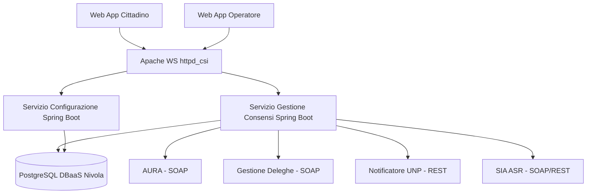

---
{"dg-publish":true,"permalink":"/wiki/concepts/architettura-iaas/","title":"Architettura IaaS","tags":["infrastruttura","iaas","cloud","nivola","csi-piemonte"],"dg-note-properties":{"title":"Architettura IaaS","aliases":["Architettura IaaS"],"type":"concept","tags":["infrastruttura","iaas","cloud","nivola","csi-piemonte"],"created":"2026-05-05","updated":"2026-07-16","sources":["2026-03-02-conspref-srs-v1-revised","2026-03-12-pile-tecnologiche-csi"],"related":["[[CSI Piemonte]]","[[2026-03-12-pile-tecnologiche-csi|Pile Tecnologiche CSI Piemonte]]","[[Gestione Consensi - Applicativo]]"]}}
---


# Architettura — Infrastruttura Progetto

> ⚠️ **Aggiornamento verbale 11/06/2026:** L'ambiente è **IaaS e non Docker/ECaaS** per tutti gli ambienti (DEV, TEST, PROD). Provisioning in carico a [[wiki/entities/csi-piemonte\|CSI Piemonte]] su indicazioni precise di Exprivia. Skeleton del progetto in carico a Exprivia. Le sezioni Kubernetes/ECaaS sotto erano basate su SRS §3.5 — potrebbero non applicarsi: verificare con CSI prima della fase di provisioning.

Infrastruttura cloud [[wiki/entities/csi-piemonte\|CSI Piemonte]] su Nivola per il progetto [[wiki/concepts/gestione-consensi-applicativo\|Gestione Consensi - Applicativo]]. Ambiente **IaaS** (non ECaaS/Kubernetes) per tutti gli ambienti.

> ⚠️ **Nota di allineamento (2026-06-18):** l'SRS è stato riscritto in chiave IaaS (§3.5). I componenti e i vincoli elencati sotto (IngressController Traefik, CNI Cilium, deploy Helm/GitOps, namespace isolato, registry Artifactory, livenessProbe/readinessProbe) **derivano dal modello ECaaS/Kubernetes** e **non si applicano automaticamente all'ambiente IaaS**: vanno ridefiniti con CSI. Sono mantenuti qui come riferimento storico/transitorio finché CSI non fornisce i dettagli IaaS (deploy, ingress/TLS, gestione segreti, CI/CD). Cfr. SRS §3.5 e i punti aperti infrastrutturali §3.5.6.
>
> **Aggiornamento 07/2026 (doc `ElencoUrlTools`):** modello di deploy IaaS chiarito → **automation Chef via ADA** + GitLab/Jenkins/SonarQube/Artifactory/ASGARD (vedi §Toolchain CSI). Restano da precisare solo **ingress/TLS** e **gestione segreti applicativi**.

---

## Componenti infrastrutturali

| Componente | Tecnologia | Note |
|---|---|---|
| Orchestrazione / deploy | **IaaS Nivola (VM) + automation Chef via ADA** (07/2026) | No Kubernetes; deploy con cookbook Chef (ADA Deployer) |
| IngressController | **TRAEFIK** (solo questo) | No altri IngressController |
| Storage | NFS via StorageClass CSI Trident (NetApp) | No host volumes |
| Monitoraggio | Prometheus | Metriche e alert |
| Log | Stack ELK (ElasticSearch + LogStash + Kibana) | Log centralizzati |
| CNI | Cilium | NetworkPolicy gestite centralmente |
| Deploy | **ADA Deployer (cookbook Chef) su Nivola** | Automation Chef; no Helm/GitOps (07/2026) |
| Registry immagini | Artifactory CSI | Solo docker-trusted, docker-base, docker-projects |

---

## Vincoli architetturali obbligatori

- **No** KNative, Istio, network mesh
- **No** installazioni software a livello Cluster
- **No** immagini esterne ad Artifactory CSI
- Ogni Deployment: `resources.requests` e `resources.limits` obbligatori
- Ogni Deployment: `livenessProbe` e `readinessProbe` obbligatori
- Helm chart: solo dipendenze da chart CSI (helm-base, helm-projects)

---

## Registry immagini per il progetto

| Registry | Scopo |
|---|---|
| docker-trusted | Immagini pubbliche validate, as-is |
| docker-base | Immagini customizzate CSI (httpd_csi, angular, spring-boot) |
| docker-projects | Immagini build del progetto |

**Immagini di riferimento progetto:**
- Backend: `reference/spring-boot` (docker-base)
- Frontend: `angular` (docker-base)
- Web Server: `httpd_csi` (docker-base)

---

## Pipeline CI/CD (toolchain CSI — confermata 07/2026)

```
GitLab (sorgenti) → Jenkins CI (SAST SonarQube + SCA BOSS/Meterian)
   → Jenkins CD/RELEASE (build artefatti/pacchetti) → Artifactory (repart)
   → deploy via ADA Deployer (automation con cookbook Chef) su Nivola
   → consegna software/documentazione al committente via ASGARD
```

> 🔄 **07/2026 (doc `ElencoUrlTools`):** il deploy IaaS **non** usa Helm/GitOps/Kubernetes ma **automation Chef tramite ADA** (Designer/Deployer su `ada.nivolapiemonte.it`). Dettaglio nel §Toolchain CSI.

---

## Toolchain CSI (confermata 07/2026)

Fonte: `ElencoUrlTools` (CSI). Strumenti del processo di sviluppo/deploy su IaaS:

| Strumento | Funzione | URL |
|---|---|---|
| GitLab | Repository codice sorgente | `gitlab.csi.it` |
| Jenkins CI | Continuous integration: SAST (SonarQube) + SCA (BOSS/Meterian) | `jenkins-ci.csi.it` |
| Jenkins CD / RELEASE | Build componenti + pacchetti di installazione | `jenkins-cd.toolchain.csi.it` |
| SonarQube | Qualità codice (SAST) | `sonarqube.toolchain.csi.it` / `sonarqube.csi.it` |
| Artifactory (Repo / Repart) | Repository librerie / artefatti | `repo.toolchain.csi.it` · `repart.csi.it/artifactory` |
| **ADA Designer / Deployer** | **Automation deploy con cookbook Chef su Nivola** | `ada.nivolapiemonte.it/designer` · `/deployer` |
| BOOST | Backoffice della toolchain di automation | `boost.toolchain.csi.it` |
| ASGARD | Consegna software/documentazione al committente (fornitore esterno) | `asgard.csi.it` |
| Anagrafica Prodotti / ARGO | Censimento asset e interfacce esposte/fruite | `anaprod.csi.it` · `app-argo.csi.it` |

Accesso: matricola/password di dominio (domnt) per GitLab/Jenkins/SonarQube/Artifactory; mail CSI per ADA/BOOST/ARGO/Anagrafica. Serve **utenza CSI** e, per lo Store API di test, **VPN**.

---

## DBaaS Nivola (database)

Il DB è **esterno all'applicativo** — erogato come servizio gestito da Nivola (DBaaS).
- Provisioning via scheda formale a Nivola (alta latenza)
- Backup, patching, HA: gestiti da Nivola
- Credenziali: mai nel codice → gestite lato infrastruttura IaaS CSI → variabili env Spring
- HikariCP: max-pool-size ≤ 40/replica (istanza 100 conn max, 2 repliche)

> 🔄 **Stato 07/2026 (email CSI):** provisioning DBaaS **in corso**. Per contenere i costi si creano solo gli ambienti **DEV** e **pre-prod** (no PROD in questa fase). Sul DB di **DEV** verrà fornito un **ribaltamento dei dati** attualmente presenti sul DB di **TEST (PostgreSQL 9.6)** → base dati reale per lo sviluppo e per collaudare la migrazione PG9→PG18 (target aggiornato da PG17 a PG18, call CSI 06/08/2026).

---

## Accesso alla piattaforma

- Utenza CSI richiesta per consulenti Exprivia
- Toolchain (GitLab/Jenkins/SonarQube/Artifactory): matricola/password di dominio (domnt); ADA/BOOST/ARGO: mail CSI; Store API di test: VPN (vedi §Toolchain CSI)
- ~~Rancher CLI + kubeconfig da referente CSI; console web nivola-rancher2.nivolapiemonte.it (OpenLDAP)~~ *(retaggio ECaaS/Kubernetes — non applicabile all'ambiente IaaS)*

---

## Diagramma di alto livello (Mermaid)



---

## ADR correlati

| ADR | Decisione |
|---|---|
| [ADR-002](ADR-002-piattaforma-ecaas.md) | Piattaforma ECaaS Kubernetes Nivola + vincoli — **superseded** (verbale 11/06/2026: ambiente IaaS) |
| [ADR-003](ADR-003-dbaas-nivola.md) | DBaaS Nivola esterno all'infrastruttura IaaS |
